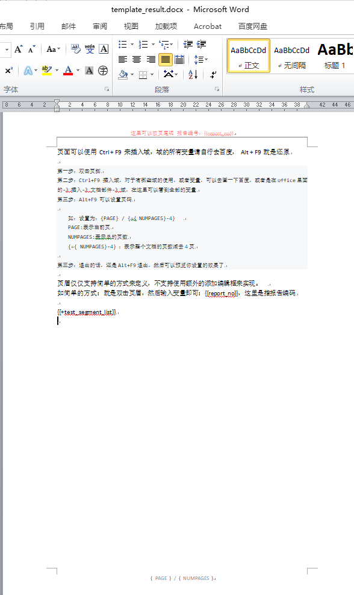
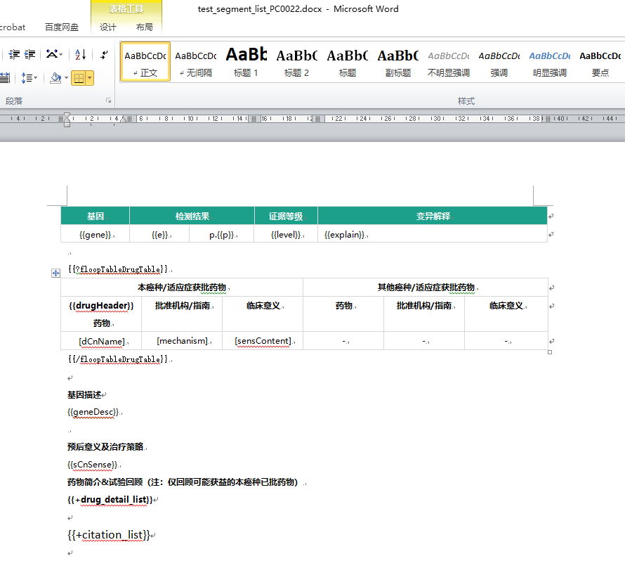
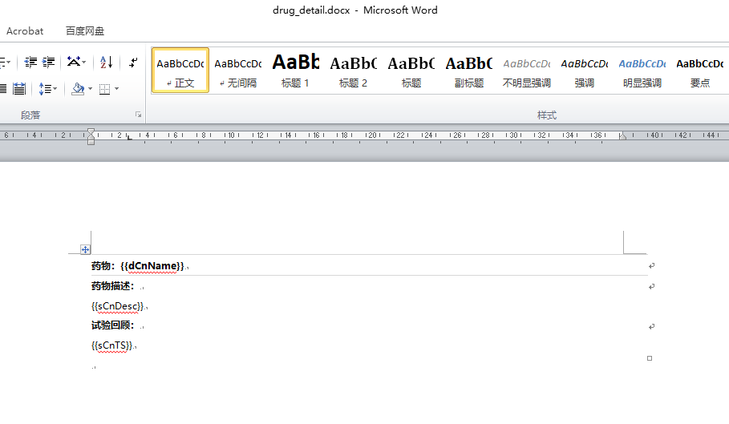
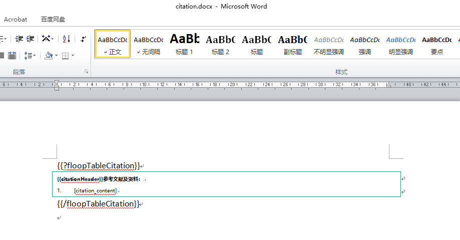
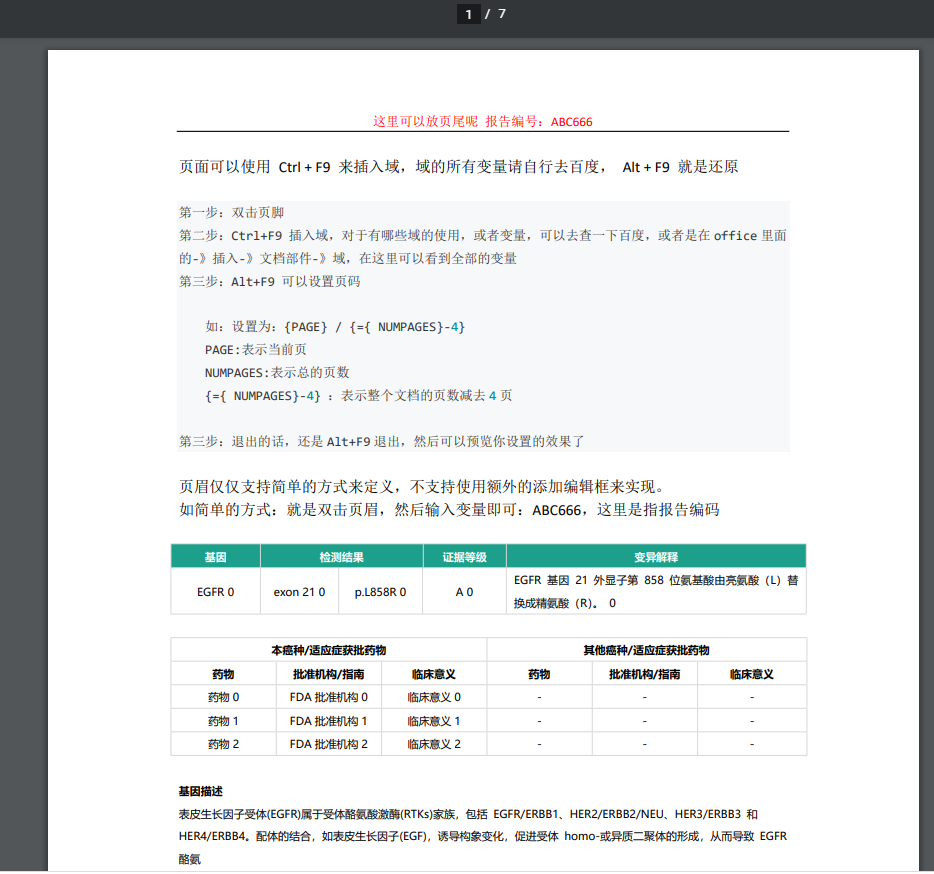
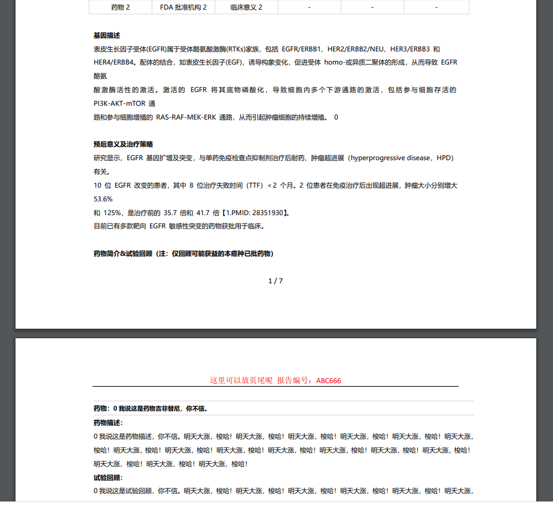

# AutomaticReportGeneration

根据自定义好的 word 文档样式，自动生成报告，含word、PDF格式

毫不夸张的说，这是最简单、最便捷、最容易定义样式的报告生成方式，不信你继续往下看

### 一、主要实现代码

#### 01、测试方法：
```
    /**
     * 测试word模板 块循环填充，块内还有小块循环填充
     * 主要测试是 块内循环填充
     * */
    @Test
    public void blockFill(){

        String templateName = "template_result.docx";

        String path = "D:\\demo\\upload\\templates\\";
        String test_segmentName = path + "test_segment_list_PC0022.docx";
        String drug_detailName = path + "drug_detail.docx";
        String citationName = path + "citation.docx";

        Map<String, Object> datas = new HashMap<>();

        //药物列表的数据
        Map<String, Object> floopTableDrugTable = new HashMap<>();
        List<Map<String, Object>> drugHeader = new ArrayList<>();
        for (Integer i = 0; i < 3; i++) {
            Map<String, Object> drugMap = new HashMap<>();
            drugMap.put("dCnName", "药物" + i);
            drugMap.put("mechanism", "FDA批准机构" + i);
            drugMap.put("sensContent", "临床意义" + i);

            drugHeader.add(drugMap);
        }
        floopTableDrugTable.put("drugHeader", drugHeader);

        //参考文献的数据
        Map<String, Object> floopTableCitation = new HashMap<>();
        List<Map<String, Object>> citationHeader = new ArrayList<>();
        for (Integer i = 0; i < 3; i++) {
            Map<String, Object> citationMap = new HashMap<>();
            citationMap.put("citation_content", "文献内容 " + i);

            citationHeader.add(citationMap);
        }
        floopTableCitation.put("citationHeader", citationHeader);

        //总的数据
        List<Map<String, Object>> test_segment_list = new ArrayList<>();
        for (Integer i = 0; i < 3; i++) {
            Map<String, Object> testSegmentMap = new HashMap<>();
            testSegmentMap.put("gene", "EGFR " + i);
            testSegmentMap.put("e", "exon 21 " + i);
            testSegmentMap.put("p", "L858R " + i);
            testSegmentMap.put("level", "A " + i);
            testSegmentMap.put("explain", "EGFR 基因 21 外显子第 858 位氨基酸由亮氨酸（L）替换成精氨酸（R）。 " + i);

            testSegmentMap.put("geneDesc", "表皮生长因子受体(EGFR)属于受体酪氨酸激酶(RTKs)家族，包括 EGFR/ERBB1、HER2/ERBB2/NEU、HER3/ERBB3 和\n" +
                    "HER4/ERBB4。配体的结合，如表皮生长因子(EGF)，诱导构象变化，促进受体 homo-或异质二聚体的形成，从而导致 EGFR 酪氨\n" +
                    "酸激酶活性的激活。激活的 EGFR 将其底物磷酸化，导致细胞内多个下游通路的激活，包括参与细胞存活的 PI3K-AKT-mTOR 通\n" +
                    "路和参与细胞增殖的 RAS-RAF-MEK-ERK 通路，从而引起肿瘤细胞的持续增殖。 " + i);
            testSegmentMap.put("sCnSense", "研究显示，EGFR 基因扩增及突变，与单药免疫检查点抑制剂治疗后耐药、肿瘤超进展（hyperprogressive disease，HPD）有关。\n" +
                    "10 位 EGFR 改变的患者，其中 8 位治疗失败时间（TTF）＜2 个月。2 位患者在免疫治疗后出现超进展，肿瘤大小分别增大 53.6%\n" +
                    "和 125%，是治疗前的 35.7 倍和 41.7 倍【1.PMID: 28351930】。\n" +
                    "目前已有多款靶向 EGFR 敏感性突变的药物获批用于临床。\n");

            //表格循环
            testSegmentMap.put("floopTableDrugTable", floopTableDrugTable);

            //小块循环
            List<Map<String, Object>> drug_detail_list = new ArrayList<>();
            for (Integer j = 0; j < 3; j++) {

                Map<String, Object> drugDetailMap = new HashMap<>();
                drugDetailMap.put("dCnName", j + "我说这是药物吉非替尼，你不信。");
                drugDetailMap.put("sCnDesc", j + "我说这是药物描述，你不信。明天大涨，梭哈！明天大涨，梭哈！明天大涨，梭哈！明天大涨，梭哈！明天大涨，梭哈！明天大涨，梭哈！明天大涨，梭哈！明天大涨，梭哈！明天大涨，梭哈！明天大涨，梭哈！明天大涨，梭哈！明天大涨，梭哈！明天大涨，梭哈！明天大涨，梭哈！明天大涨，梭哈！明天大涨，梭哈！ ");
                drugDetailMap.put("sCnTS", j + "我说这是试验回顾，你不信。明天大涨，梭哈！明天大涨，梭哈！明天大涨，梭哈！明天大涨，梭哈！明天大涨，梭哈！明天大涨，梭哈！明天大涨，梭哈！明天大涨，梭哈！明天大涨，梭哈！明天大涨，梭哈！明天大涨，梭哈！明天大涨，梭哈！明天大涨，梭哈！明天大涨，梭哈！明天大涨，梭哈！明天大涨，梭哈！ ");
                drug_detail_list.add(drugDetailMap);
            }
            //这里才是至关重要的
            DocxRenderData segment_drug = new DocxRenderData(new File(drug_detailName), drug_detail_list);
            testSegmentMap.put("drug_detail_list", segment_drug);

            //参考文献块
            List<Map<String, Object>> citation_list = new ArrayList<>();
            Map<String, Object> floopCitation = new HashMap<>();
            floopCitation.put("floopTableCitation", floopTableCitation);
            citation_list.add(floopCitation);

            DocxRenderData segment_citation = new DocxRenderData(new File(citationName), citation_list);
            testSegmentMap.put("citation_list", segment_citation);

            test_segment_list.add(testSegmentMap);
        }

        //最终这个块的数据是通过这里赋值
        DocxRenderData segment_main = new DocxRenderData(new File(test_segmentName), test_segment_list);
        datas.put("test_segment_list", segment_main);
        datas.put("report_no", "ABC666");

        //定义标签，用于表格循环提取
        ArrayList tagList = new ArrayList<String>();
        tagList.add("drugHeader");
        tagList.add("citationHeader");

        System.out.println("template datas: " + JsonUtils.toJson(datas));

        String wordFileName = Tools.getUUID() + ".docx";
        Map<String, Object> res = generateReportService.template2WordPdf(templateName, wordFileName, datas, tagList);
        System.out.println("报告生成结果 res:" + JsonUtils.toJson(res));

    }
```

#### 02、template2WordPdf方法：主要是实现填充word模板，即word模板数据渲染，生成.docx格式文档，然后再将其转换为PDF
```
    /**
     * 填充word模板，保存两份文件：一份是word文档、一份是pdf，最后验证是否生成word、pdf文件
     *
     * @param templateName 模板名称
     * @param wordFlieName 生成word文件名称
     * @param datas        模板里面的数据，map
     * @param tagList      表格标签，用于标记循环表格
     * @return Map<String, Object>  关键词status、msg用于标记是否生成报告
     ***/
    protected Map<String, Object> template2WordPdf(String templateName, String wordFlieName, Map<String, Object> datas, ArrayList<String> tagList) {
        Map<String, Object> res = new HashMap<>();
        String path = "/report/" + DateUtils.getNow("yyyyMM");//指定生成的路径, uploadDir+/report/202001/
        File dir = new File(uploadDir + path);
        if (!dir.exists()) {
            if (!dir.mkdirs()) {
                log.error("无法创建目录：" + uploadDir + path);
                res.put("status", 0);
                res.put("msg", "无法创建目录");
                return res;
            }
        }
        String templatePath = "";
        try {
            String prefix = uploadDir + "/templates/";
            templatePath = prefix + templateName;
            log.info("templatePath: " + templatePath);
        } catch (Exception e) {
            log.error("get templates failed: " + templateName + "\n" + e.getStackTrace());
            res.put("status", 0);
            res.put("msg", "获取模板失败: " + templateName);
            return res;
        }
        ZipSecureFile.setMinInflateRatio(0);
        HackLoopTableRenderPolicy hackLoopTableRenderPolicy = new HackLoopTableRenderPolicy();
        Configure configure = new ConfigureBuilder().build();
        for (String tag : tagList) {
            configure.customPolicy(tag, hackLoopTableRenderPolicy);
        }

        XWPFTemplate template = XWPFTemplate.compile(templatePath, configure).render(datas);
        try {
            template.writeToFile(uploadDir + path + "/" + wordFlieName);
        } catch (Exception e) {
            log.error("填充word文档失败: \n" + e.getMessage());
            res.put("status", 0);
            res.put("msg", "生成word文档失败");
            return res;
        }
        Word2PdfUtils.toPdf(uploadDir + path + "/" + wordFlieName, uploadDir + path + "/" + wordFlieName.replace(".docx", ".pdf"));
        File wordFlie = new File(uploadDir + path + "/" + wordFlieName);
        File pdfFlie = new File(uploadDir + path + "/" + wordFlieName.replace(".docx", ".pdf"));
        Map<String, Object> data = new HashMap<>();
        if (wordFlie.exists() && pdfFlie.exists()) {
            res.put("status", 1);
            data.put("wordPath", path + "/" + wordFlieName);
            data.put("pdfPath", path + "/" + wordFlieName.replace(".docx", ".pdf"));
            res.put("data", data);
            res.put("msg", "success");
            return res;
        } else if (!wordFlie.exists()) {
            res.put("status", -1);
            res.put("msg", "生成word文档失败");
            return res;
        } else if (!pdfFlie.exists()) {
            res.put("status", -2);
            data.put("wordPath", path + "/" + wordFlieName);
            res.put("data", data);
            res.put("msg", "生成pdf文档失败");
            return res;
        }
        return res;
    }
```

#### 03、Word2PdfUtils真正的word转PDF工具，实现如下：
```
/**
 * @Author: 
 * @Date: 2020-12-01 10:07
 * @Description: 把word文档转换成pdf
 * 解决乱套问题安装微软字库
 * mkdir /usr/share/fonts/truetype/windows-fonts
 * 拷贝中文字体到/usr/share/fonts/truetype/windows-fonts目录下
 * chmod -R 777 /usr/share/fonts/truetype/windows-fonts
 * cd /usr/share/fonts/truetype/windows-fonts
 * mkfontscale
 * mkfontdir
 * fc-cache -fv
 * fc-list :lang=zh
 **/
public class Word2PdfUtils {
    private static final Logger logger = LoggerFactory.getLogger(Word2PdfUtils.class);

    public static void toPdf(String from, String to) {
        if (!getLicense()) { // 验证License 若不验证则转化出的pdf文档会有水印产生
            return;
        }
        try {
            FileOutputStream os = new FileOutputStream(new File(to));
            Document doc = new Document(from);
            doc.save(os, SaveFormat.PDF);
        } catch (Exception e) {
            logger.error(e.getMessage(), e);
        }
    }

    private static boolean getLicense() {
        try {
            InputStream is = Word2PdfUtils.class.getClassLoader()
                    .getResourceAsStream("apose_license.xml"); // apose_license.xml应放在src路径下
            License aposeLic = new License();
            aposeLic.setLicense(is);
            return true;
        } catch (Exception e) {
            logger.error(e.getMessage(), e);
        }
        return false;
    }
}

```


#### 04、apose_license.xml内容

apose_license.xml应放在src里面的resources路径下，其实放在其他地方也可以，主要是看你读取的时候，怎么取，就怎么放

因为这里上面读取是：Word2PdfUtils.class.getClassLoader().getResourceAsStream("apose_license.xml")，所以直接放在src/resources下

```
<License>
    <Data>
        <Products>
            <Product>Aspose.Words for Java</Product>
        </Products>
        <EditionType>Enterprise</EditionType>
        <SubscriptionExpiry>29991231</SubscriptionExpiry>
        <LicenseExpiry>29991231</LicenseExpiry>
        <SerialNumber>---</SerialNumber>
    </Data>
    <Signature>---</Signature>
</License>
```

#### 05、笔者在写此 README.md 的时候，使用的版本依赖是:
```
    <!--poi-tl word模板填充-->
    <dependency>
        <groupId>com.deepoove</groupId>
        <artifactId>poi-tl</artifactId>
        <version>1.7.3</version>
    </dependency>
```


### 二、模板内容及实现效果

##### 在此项目里面有生成的 demo 文档，可以下载来查看：[DEMO-DOCX](./statics/demo/03f1a8c4-aa29-436a-8ee5-8e2f178314fd.docx)、[DEMO-PDF](./statics/demo/03f1a8c4-aa29-436a-8ee5-8e2f178314fd.pdf)

- [x] 首先看一下模板内容

template_result.docx 模板内容：




test_segment_list_PC0022.docx 模板内容：



drug_detail.docx 模板内容：



citation.docx 模板内容：




- [x] 实现效果，直接看 PDF 效果吧：

注意观察模板内容，及填充后的内容，哪里有什么变化，及你可以思考一下大概的实现方式

页眉、页脚、内容，其中内容包含复杂的类型：表格循环、区块对循环







- [x] 注意的地方：

表格循环一定要注意：你需要从哪一行开始渲染数据，就将上一行设置为表头，千万不能直接设置第一行为表头，然后隔开一行再渲染数据！！！

当前例子里面表头是：{{drugHeader}}

重复渲染数据的行是：[dCnName] 	[mechanism]	[sensContent]	-	-	-

所以 {{drugHeader}} 不能放在 “本癌种/适应症获批药物”这一行，只能放在 “药物”“批准机构/指南”这一行


### 三、小结

- 个人认为这个开源工具是最牛逼的，最容易实现及随意定义样式，就能实现美丽的报告
- 多去看一下官方文档，你一定有不一样的发现
- 遇到问题多去作者 github 提问题，作者会很快就答复你的

### 四、致谢

- [Sayi](https://github.com/Sayi)
- [poi-tl项目源码](https://github.com/Sayi/poi-tl)
- [poi-tl官方文档](http://deepoove.com/poi-tl)


### 赞赏

如果你觉得笔者辛苦了，可以的话请我喝杯咖啡，感谢你的支持


你的赞赏就是我的动力
